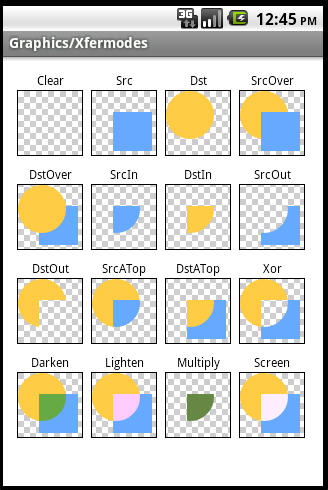

## 图片处理
- 图片模式    
RGB_565 每个pixel用2个字节存储    
ARGB_8888 每个pixel用4个字节存储    
图像文件的字节数(Byte) = 图像分辨率*bit/8，例如一幅640*480图像分辨率、RGB色一般为24位真彩色,图像未经压缩的数据容量为：640X480X24/8＝921600字节=900KB。因此加载的图片所占的内存大小，取决于其分辨率和颜色数

- Immutable bitmap passed to Canvas constructor异常
  android是不容许在代码里批改res文件里的图片.    
方法
```
BitmapFactory.decodeResource（getResources（）， R.drawable.logo);
```
生成的bitmap是不能修改的，可以替换为
```
BitmapFactory.decodeResource（getResources（）， R.drawable.logo）.copy（Bitmap.Config.ARGB_8888， true）;
```
或者
```
Bitmap bitmap = Bitmap.createBitmap(width, height, Bitmap.Config.ARGB_8888);
```
其他方法    
[https://github.com/cwj10/toolbox/blob/master/utilbox/src/main/java/com/cwj/utilbox/BitmapUtil.java](https://github.com/cwj10/toolbox/blob/master/utilbox/src/main/java/com/cwj/utilbox/BitmapUtil.java)   
[https://github.com/cwj10/toolbox/blob/master/utilbox/src/main/java/com/cwj/utilbox/ImageUtils.java](https://github.com/cwj10/toolbox/blob/master/utilbox/src/main/java/com/cwj/utilbox/ImageUtils.java)

- Paint Xfermode用法    
paint的setXfermode方法可以设置两张图片相交时的效果。常见的Xfermode（SRC为原图，DST为目标图），把代码中的SRC_IN换成下图指定的模式就会出现对应的效果图。
```
Canvas canvas =  new  Canvas(Src);
paint.setXfermode( new  PorterDuffXfermode(Mode.SRC_IN));
canvas.drawBitmap(Dst, 0f, 0f, paint);
```
效果图如下：    
    
可以为图片设置圆角等效果
```
public void toRoundCorner(){
       Bitmap bitmap = BitmapFactory.decodeResource(getResources(), R.mipmap.logo);
       Bitmap output = Bitmap.createBitmap(bitmap.getWidth(), bitmap.getHeight(), Bitmap.Config.ARGB_8888);
       Canvas canvas = new Canvas(output);
       Rect rect = new Rect(0,0,bitmap.getWidth(), bitmap.getHeight());
       RectF rectF = new RectF(rect);
       Paint paint = new Paint();
       final int color = 0xff424242;
       paint.setAntiAlias(true);
       canvas.drawARGB(0, 0, 0, 0);
       paint.setColor(color);
       canvas.drawRoundRect(rectF,20,20,paint);
       paint.setXfermode(new PorterDuffXfermode(PorterDuff.Mode.SRC_IN));
       canvas.drawBitmap(bitmap, rect, rect, paint);
       imageView.setImageBitmap(output);
   }
```
- ImageLoader    
[Picasso](https://github.com/square/picasso)    
[Glide](https://github.com/bumptech/glide)    
[ion](hhttps://github.com/koush/ion)    
[Universal Image Loader](https://github.com/nostra13/Android-Universal-Image-Loader)    
[Volley](https://android.googlesource.com/platform/frameworks/volley)    
[Fresco](https://github.com/facebook/fresco)  
## 参考资料
[http://www.oschina.net/question/231733_44154](http://www.oschina.net/question/231733_44154)    
[http://www.oschina.net/android/73/](http://www.oschina.net/android/73/)    
